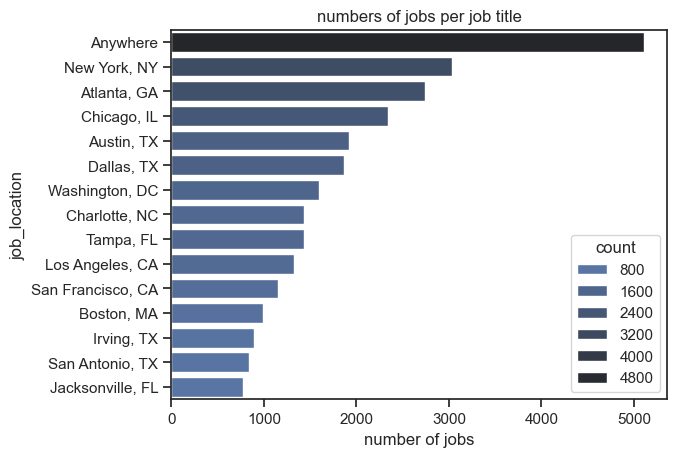
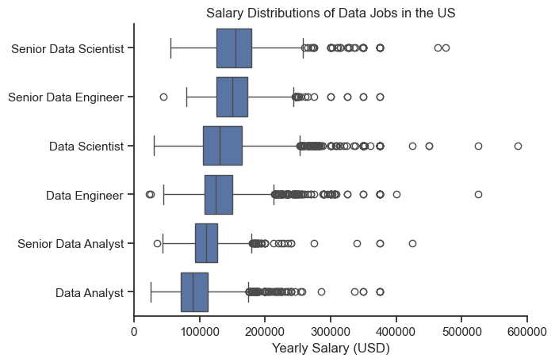

Overview
This project presents a comprehensive analysis of the data analyst job market in the United States, with a focus on data analyst roles. The goal is to identify the most in-demand and highest-paying skills, helping anyone interested in the data analytics field to better understand the market and make informed career decisions.
The data is sourced from [lukebarousse/data_jobs] and includes details on job titles, salaries, locations, and required skills. Python and data analysis libraries were used to answer important questions about skill demand, salary trends, and the most valuable skills that combine high demand with high pay.

Key Questions
What are the most in-demand skills for the top 3 most common jobs in data analytics?

How do the required skills for data analysts change over time?

What is the relationship between skills and salaries for data analysts?

What are the ideal skills that combine high demand and high salary?

Tools Used
Python (Pandas, Matplotlib, Seaborn): for data cleaning, analysis, and visualizations.

Jupyter Notebooks: to document the analysis interactively.

Visual Studio Code: for code editing and project management.

Git & GitHub: for version control and project sharing.

Data Cleaning and Preparation
The dataset was imported and cleaned to focus on jobs in the United States. Skill fields were converted from string to lists, and missing or inconsistent values were handled.

python

<pre> ```python import ast import pandas as pd import seaborn as sns from datasets import load_dataset import matplotlib.pyplot as plt dataset = load_dataset("lukebarousse/data_jobs") df = dataset['train'].to_pandas() df['job_posted_date'] = pd.to_datetime(df['job_posted_date']) df['job_skills'] = df['job_skills'].apply(lambda x: ast.literal_eval(x) if pd.notna(x) else x) df_US = df[df['job_country'] == 'United States'] ``` </pre>
Analysis and Visualizations

1. Most In-Demand Skills for the Top 3 Common Job Titles
   The three most frequent job titles were identified, and the top 15 required skills for each were extracted.
   
   [Most In-Demand Skills]

SQL is the most in-demand skill for data analysts and data scientists.

Data engineers require more specialized technical skills like AWS and Spark.

Python is highly demanded across all three roles.

2. Skill Trends for Data Analysts Over Time
   The monthly demand for top skills in 2023 was analyzed.
   
   [Skill Trends]

SQL demand remained steady throughout the year.

Excel saw increased demand toward the end of the year.

Python and Tableau maintained stable demand.

3. Salary Analysis by Job Title and Skill
   Salaries for key roles were analyzed, along with the impact of specific skills on salary.
   
   [Salary Distribution]

Senior roles (e.g., Senior Data Scientist/Engineer) have the highest salaries.

Data analysts have more stable but lower salary ranges.

Top-Paying and Most In-Demand Skills for Data Analysts


Specialized technical skills like dplyr and Bitbucket are associated with higher salaries.

Fundamental skills like Excel and SQL are the most in-demand.

What I Learned
Mastery of data cleaning and analysis using Python.

Deep understanding of the job market and data analyst requirements.

The importance of clear and professional data visualization.

Challenges
Handling missing or inconsistent data.

Designing visualizations that clearly communicate results.

Balancing detailed analysis with an overall picture.

Conclusion
This project provides a clear picture of the data analytics job market in the U.S. It helps anyone interested in this field identify which skills to focus on to achieve the best job opportunities and highest income.
